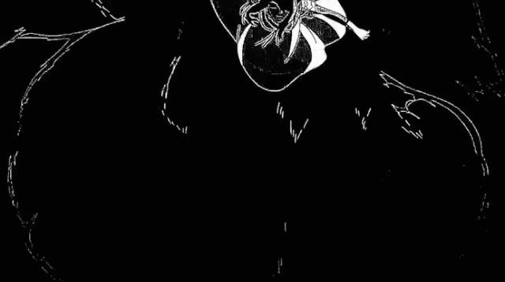

  

#

Me chamo Otávio Suptil Ferraz, tenho 16 anos e moro em Foz do Iguaçu. Atualmente curso Tecnico em Desenvolvimento de Sistema junto ao Ensino Meio no IFPR- Campus Foz do Iguaçu. 
 
#

<h3 align="left">Connect with me!</h3>

<h3 align="left">My Stack ~</h3>

 
 

<h3 align="left">GitHub Stats</h3>

  

<picture align="center">
  <source media="(prefers-color-scheme: dark)" srcset="https://raw.githubusercontent.com/Otavio-666/Otavio-666/output/github-contribution-grid-snake-dark.svg">
  <source media="(prefers-color-scheme: light)" srcset="https://raw.githubusercontent.com/Otavio-666/Otavio-666/output/github-contribution-grid-snake-dark.svg">
  
</picture>

